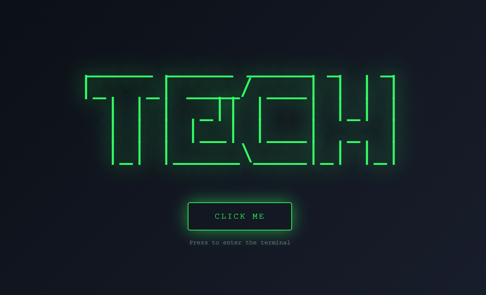
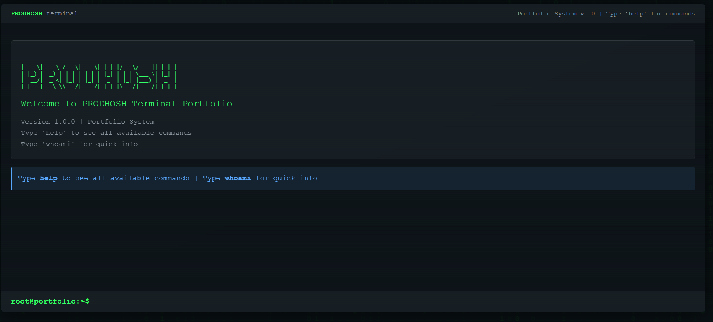

# 🚀 PRODHOSH Terminal Portfolio

  
  

#### Terminal Portfolio · 3D Animated · Cyberpunk · VIT CS · IITM Data Science

---

### 🌌 Live Demo

[🚩 Experience the Animation!](https://prodhosh.github.io/whoisprodhosh_portfolio/)  

---

### 🧬 Features

- Fully animated boot/terminal interface 💻  
- Matrix rain 3D effect in background 🌧️  
- Neon glowing UI with dark theme 🟢  
- Interactive commands: `about`, `skills`, `projects`, `certifications`, etc.  
- Links to projects, social profiles, and resume directly in the UI  
- Responsive and accessible on mobile  

---

### 📂 Tech Stack

- **HTML**, **CSS**, **JavaScript**
- FontAwesome, Custom CSS Animations  
- Matrix Rain 3D Canvas  
- Responsive Design for all devices  

---

### 👤 Author

**Prodhosh V.S**  
_Aspiring Data Scientist_ (VIT Chennai · IIT Madras)  
[GitHub](https://github.com/prodhosh) | [LinkedIn](https://www.linkedin.com/in/prodhoshvs)

---

  
    🚨  Powered by creative code, glowing neon, and personal ambition 🚨
  

